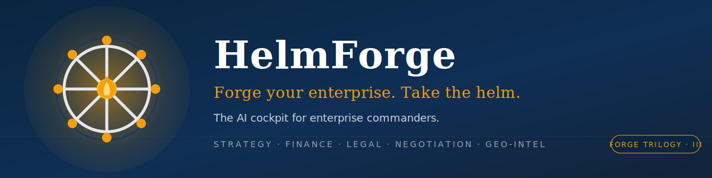
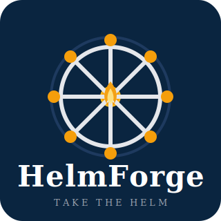

<div align="center">



# ⚓ HelmForge

### Forge your enterprise. Take the helm.

**企业掌舵者的 AI 经营驾驶舱 · Forge 三部曲 · 第三部**

[](./LICENSE)
[](./ETHICS.md)
[](#-多镜像部署)
[](#-技能矩阵18-skill)
[](./CONTRIBUTING.md)
[](./docs/superpowers/specs/2026-07-04-helmforge-design.md)

</div>

---

## 📖 HelmForge 是什么

HelmForge 是 **Forge 三部曲** 的收官之作：

- 🛠️ **[CodeForge](https://github.com/PancrePal-xiaoyibao/CodeForge)** — 开发者 → 开源贡献引擎
- 🧬 **[VitaForge](https://github.com/PancrePal-xiaoyibao/VitaForge)** — 研究者 → 生命科学引擎
- ⚓ **HelmForge**（本项目）— 掌舵者 → 企业经营引擎

它是面向 **CEO / CFO / COO / 部门负责人 / 创业者 / 家族传承人 / 企业战略与经营团队** 的 AI 经营副驾驶。一个入口（`/executive-consultant` 主调度）智能路由 **18 个专业 skill**，覆盖五大板块：

- 🧭 **战略决策** — 战略咨询 / 商业模式 / 地缘宏观 / 深度调研
- 💰 **财务预算** — 三大报表管理 / 预算编制 / 电商财务
- 🏛️ **组织治理** — 高级行政秘书 / 对外谈判 / 全球法律顾问
- 📦 **交付展示** — Office 文档 / PPT 模板 / 代码生成 PPT / HTML 演示 / PDF 提取
- 🔧 **治理引擎** — 多 skill 联动设计 / 五镜像部署 / 单 skill 质量门控

### 💡 核心差异化

| # | 特性 | 说明 |
|---|---|---|
| 1 | 驾驶舱式统管 | 一个主调度路由 18 个专业 skill，不再散装拼 prompt |
| 2 | 财商融合 | 全新设计 `finance-manager` + `budget-architect` + `strategy-cfo`，补齐财务视角 |
| 3 | 宏观地缘 | 内置 `geo-sentinel`（地缘政治 + 宏观新闻预测），服务出海与宏观风险决策 |
| 4 | 四镜像实质部署 | Claude / Codex / Antigravity / OpenClaw 系（WorkBuddy / 龙虾）+ 通用 Agent 一句话 |
| 5 | 永久非商业 | PolyForm-NC 保护项目特殊性，配套企业经营 ETHICS 八条红线 |

---

## 🚀 一键部署

克隆仓库并运行对应平台的一键部署脚本。默认目标目录是 `$HOME`（即 `%USERPROFILE%` / `~`），会把 4 个镜像 skill（`.claude/` `.codex/` `.gemini/` `.agents/`）融合去重后部署到全局。

```bash
git clone https://github.com/hhx465453939/HelmForge.git
cd HelmForge
```

### Windows PowerShell

```powershell
# 默认部署（含备份、含 post-smoothing 校验）
powershell -ExecutionPolicy Bypass -File .\deploy\deploy.ps1 -Yes

# 部署到自定义目录（例如沙盒测试）
powershell -ExecutionPolicy Bypass -File .\deploy\deploy.ps1 -Yes -Target D:\sandbox

# 干跑（只报告不写文件）
powershell -ExecutionPolicy Bypass -File .\deploy\deploy.ps1 -Yes -DryRun

# 同时安装入口文档（CLAUDE.md / AGENTS.md / GEMINI.md / OPENCLAW.md）到目标根
powershell -ExecutionPolicy Bypass -File .\deploy\deploy.ps1 -Yes -InstallEntryDocs
```

### macOS / Linux Bash

```bash
chmod +x ./deploy/deploy.sh
./deploy/deploy.sh --yes
./deploy/deploy.sh --yes --target ~/sandbox
./deploy/deploy.sh --yes --dry-run
./deploy/deploy.sh --yes --install-entry-docs
```

支持的开关：`--yes`、`--target <dir>`、`--no-backup`、`--install-entry-docs`、`--force`、`--dry-run`（PowerShell 版本对应 `-Yes` / `-Target` / `-NoBackup` / `-InstallEntryDocs` / `-Force` / `-DryRun`）。

部署完成后目标目录会产出：

- `deploy-manifest.json` — 4 镜像的文件清单与 MD5
- `deploy-report.md` — 人类可读的部署总结
- 可选的 pre-deploy 备份到 `<target>/.helmforge-backup/<timestamp>/`

### 通用 Agent 一句话部署（不带脚本的场景）

如果你的 harness 不方便跑本地脚本（例如某些云端 IDE / 远程 agent），可以把下面这段 prompt 直接丢给 agent，让它替你完成"拉取 → 融合去重 → 部署 → 校验"：

```text
帮我把 https://github.com/hhx465453939/HelmForge 部署为 HelmForge 全局技能包。

要求：
1. clone 仓库到临时目录；
2. 读取 .claude/ .codex/ .gemini/ .agents/ 四个镜像下所有 skill；
3. 融合去重（同名 skill 保留 MD5 一致的一份），写到我的 $HOME 下对应目录；
4. 如果我的 harness 只认某一份（例如 .claude），只落这一份即可；
5. 部署完读取 CLAUDE.md / AGENTS.md / GEMINI.md / OPENCLAW.md 中至少一份路由表，
   把 /executive-consultant 作为主调度入口注册；
6. 输出：部署清单、路由表快照、以及"下一步试用 3 条命令"的建议。

红线：不修改 LICENSE / ETHICS.md；不商业化；一切遵循 PolyForm-NC + HelmForge 8 条红线。
```

---

## 📊 技能矩阵（18 skill）

一个 `/executive-consultant` 入口，5 个板块，18 个专业 skill。每个 skill 都有独立的 `.claude/skills/<name>/SKILL.md`（其它三镜像同名同 MD5）。

### 🧭 战略决策（4）

| 命令 | 一句话定位 |
|---|---|
| [`/executive-consultant`](./.claude/skills/executive-consultant/SKILL.md) | 主调度 + 参谋长增强模式，识别经营场景并路由到下游 skill |
| [`/strategy-cfo`](./.claude/skills/strategy-cfo/SKILL.md) 🆕 | 战略财务视角：商业模式 / 资本结构 / 估值区间 / 资本支出优先级 |
| [`/geo-sentinel`](./.claude/skills/geo-sentinel/SKILL.md) 🆕 | 地缘政治与宏观新闻扫描，输出对经营决策的风险与窗口判断 |
| [`/deep-research`](./.claude/skills/deep-research/SKILL.md) | 多 agent 并行深度调研，用于市场 / 竞品 / 政策 / 行业情报 |

### 💰 财务预算（3）

| 命令 | 一句话定位 |
|---|---|
| [`/finance-manager`](./.claude/skills/finance-manager/SKILL.md) 🆕 | 三大报表健康诊断、关键财务比率、估值方法论（含亏损公司） |
| [`/budget-architect`](./.claude/skills/budget-architect/SKILL.md) 🆕 | 零基预算 + 滚动预测，自上而下与自下而上双向对齐 |
| [`/ecommerce-finance`](./.claude/skills/ecommerce-finance/SKILL.md) | 电商单品毛利 / 促销 ROI / 平台佣金分账测算 |

### 🏛️ 组织治理（3）

| 命令 | 一句话定位 |
|---|---|
| [`/executive-secretary`](./.claude/skills/executive-secretary/SKILL.md) | 高级行政秘书级日程 / 通勤 / 多地行程编排（可接高德地图 MCP） |
| [`/external-negotiation-master`](./.claude/skills/external-negotiation-master/SKILL.md) | 站在委托方一侧的对外谈判 / 催款 / 报价 / 话术设计 |
| [`/global-legal-counsel`](./.claude/skills/global-legal-counsel/SKILL.md) | 顶级总法律顾问：合同 / 诉讼 / 合规 / 跨境风险 / 劳动争议 |

### 📦 交付展示（5）

| 命令 | 一句话定位 |
|---|---|
| [`/office-docs`](./.claude/skills/office-docs/SKILL.md) | PPTX / DOCX / XLSX 的读取、编辑、创建、校验全流程 |
| [`/editing`](./.claude/skills/editing/SKILL.md) | 以现有 PPTX 为模板做内容替换与布局优化 |
| [`/pptxgenjs`](./.claude/skills/pptxgenjs/SKILL.md) | 从零用 PptxGenJS 代码生成 PPTX 演示文稿 |
| [`/frontend-slides`](./.claude/skills/frontend-slides/SKILL.md) | 生成炫酷 HTML 演示（前端向路演 / 发布会 / 内评审风格） |
| [`/pdf-reader`](./.claude/skills/pdf-reader/SKILL.md) | 用 pdfplumber 提取本地 PDF 文本并落 Markdown |

### 🔧 治理引擎（3）

| 命令 | 一句话定位 |
|---|---|
| [`/loop-engineer`](./.claude/skills/loop-engineer/SKILL.md) | 多 skill 联动 package 设计与联动完整性审计 |
| [`/skill-deploy`](./.claude/skills/skill-deploy/SKILL.md) | 融合去重 + 系统级部署 + post-smoothing 四镜像校验 |
| [`/skill-governor`](./.claude/skills/skill-governor/SKILL.md) | 单 skill 新增 / 升级的规范门控（frontmatter / references / 四镜像同步） |

🆕 = HelmForge 全新设计的核心增量（**9 已有 + 4 池子复用 + 3 全新 + 2 借用 Forge 姊妹项目**）

---

## 🔌 推荐 MCP（可选）

HelmForge 的核心 skill 全部**离线可用**（graceful degradation），但接上下列 MCP 后能力更完整。模板见 [`deploy/mcp-config.template.json`](./deploy/mcp-config.template.json)。

| MCP | 面向 skill | 增强能力 |
|---|---|---|
| **高德地图 MCP** (`@amap/amap-maps-mcp-server`) | `/executive-secretary` | 真实通勤时间 / 多地行程路线规划 / 会议地点选址 |
| **财经数据 MCP** (`finance-mcp-server`) | `/finance-manager`、`/strategy-cfo` | A 股 / 港股 / 美股行情、财报、宏观指标、可比公司数据 |

配置示例：

```jsonc
{
  "mcpServers": {
    "amap-maps": {
      "command": "npx",
      "args": ["-y", "@amap/amap-maps-mcp-server"],
      "env": { "AMAP_API_KEY": "<your-key>" }
    },
    "finance": {
      "command": "npx",
      "args": ["-y", "finance-mcp-server"],
      "env": { "TUSHARE_TOKEN": "<your-token>" }
    }
  }
}
```

> 🇨🇳 **国内 API 提供商指引**：如果你在中国大陆网络环境下使用，参见
> [`docs/cn-api-providers.md`](./docs/cn-api-providers.md) —
> 收录了主流模型 API、地图 / 金融数据源、以及 harness 层网络调优的可用组合。

---

## 🎯 典型场景（可直接照抄）

以下四组是 HelmForge 最常见的经营场景。用户只需对 `/executive-consultant` 说一句人话，主调度会自动串起下游 skill。

### 场景 1 — 融资路演准备

```text
/executive-consultant  "我要做 A 轮融资路演，帮我准备"

  → /strategy-cfo             商业模式画布 + 资本结构 + 估值区间
  → /finance-manager          三大报表健康诊断 + 关键比率
  → /budget-architect         未来 3 年滚动预测 + 现金流敏感性
  → /deep-research            可比公司 & 可比交易的市场数据支撑
  → /frontend-slides          输出 30 页 HTML 路演 deck（可导 PDF）
```

### 场景 2 — 供应商年度合同谈判

```text
/executive-consultant  "关键供应商今年要重签，帮我准备谈判"

  → /external-negotiation-master  BATNA 拆解 + 锚点设计 + 让步阶梯 + 话术
  → /global-legal-counsel         合同条款红线 + 修改建议 + 争议解决条款
  → /geo-sentinel                 供应地的地缘 / 关税 / 出口管制风险扫描
  → /office-docs                  谈判纪要 + 合同新旧版本对比 + 会签追踪
```

### 场景 3 — 年度预算编制

```text
/executive-consultant  "明年公司的预算怎么编"

  → /budget-architect     零基预算 + 自上而下战略目标下达
  → /finance-manager      基于历史财报的可行性 sanity check
  → /geo-sentinel         宏观环境假设（GDP / 汇率 / 关键政策窗口）
  → /strategy-cfo         资本支出 & 招募额度的优先级排序
  → /office-docs          输出预算包（Excel 模板 + PPT 汇报稿）
```

### 场景 4 — 敏感人事事件升级

```text
/executive-consultant  "两位高管冲突升级，需要战略决策"

  → executive-consultant         切换参谋长增强模式（自身处理决策沙盘）
  → /global-legal-counsel        劳动法 + 股权 + 竞业 + 保密协议风险审视
  → /external-negotiation-master 离职 / 复位谈判话术设计与 BATNA
  → /executive-secretary         隔离沟通节奏 & 关键会面日程编排
```

> 更多复合场景（家族信托治理、跨境搬迁、危机公关）见 [`docs/superpowers/specs/2026-07-04-helmforge-design.md`](./docs/superpowers/specs/2026-07-04-helmforge-design.md) §5。

---

## 🍴 Fork 写你自己的 Agent

HelmForge 期望的用法不是"照抄下载"，而是"**fork 出你自己那把舵**"。

推荐流程：

1. **Fork** `hhx465453939/HelmForge` 到你的账号，克隆到本地。
2. 直接在 `.claude/skills/<name>/SKILL.md` 里改文案、加你行业的术语与红线。
3. 用 [`/skill-governor`](./.claude/skills/skill-governor/SKILL.md) 起草新 skill；用
   [`/skill-deploy`](./.claude/skills/skill-deploy/SKILL.md) 做四镜像 MD5 同步。
4. 用 [`/loop-engineer`](./.claude/skills/loop-engineer/SKILL.md) 检查主调度是否已经把你的新 skill 路由进去。
5. 在你自己的 fork 里保留 PolyForm-NC；若你把它用于内部生产，请联系
   HelmForge 商业授权（见 [`ETHICS.md`](./ETHICS.md) §3.2）。
6. 如果你觉得改动值得回馈上游，参考 [`CONTRIBUTING.md`](./CONTRIBUTING.md) 提 PR。

个人 / 家族 / 内部评估用途：**永远免费**（PolyForm-NC）。

---

## 🤖 让 Agent 优化 skill 并自动发 PR（进阶）

HelmForge 的招牌玩法 —— **Agent Self-Evolution**。你的 agent（Claude / GLM / DeepSeek / Gemini …）在使用某个 skill 时发现瑕疵，可以就地调用 `/skill-governor` 起草改写方案，`/skill-deploy` 完成四镜像同步，然后 fork 仓库、提交 conventional commit（带 AI trailer）、`gh pr create` 走 HelmForge 的 PR 模板 —— 全程 human-in-the-loop（你审阅方向与最终 PR）。

完整流程与可直接复制的 prompt 见 **[`CONTRIBUTING.md`](./CONTRIBUTING.md) Path C · Agent Self-Evolution**。三条贡献路径：

- **Path A** · 报告问题 / 建议新 skill（不需要写代码）
- **Path B** · 手动 PR 改进已有 skill（熟悉 Git 工作流）
- **Path C** · Agent 自进化 —— 让 AI 自己起草改写并提 PR，你审阅（**推荐**）

---

## 🪞 多镜像部署

| 镜像平台 | 目录结构 | 入口文档 | 状态 |
|---|---|---|---|
| **Claude Code** | `.claude/commands/*.md` + `.claude/skills/*/` | `CLAUDE.md` | ✅ 完整 |
| **Codex CLI** | `.codex/skills/*/` | `AGENTS.md` | ✅ 完整 |
| **Antigravity**（原 Gemini） | `.gemini/skills/*/` | `GEMINI.md` | ✅ 按 Gemini 格式完整 |
| **OpenClaw / WorkBuddy / 龙虾** | `.agents/skills/*/` | `OPENCLAW.md` | ✅ 实质支持 |
| **通用 Agent 一句话部署** | — | 见本 README | ✅ |

每个镜像的 `/executive-consultant` 都内置**相同的 Package 主调度路由表**，由 `/skill-deploy` post-smoothing 校验；四份 SKILL.md 的 MD5 必须一致（有意分叉需在 PR body 说明）。

---

## 📜 License & Ethics

### License: PolyForm Noncommercial 1.0.0

详见 [`LICENSE`](./LICENSE)。

- ✅ **非商业使用 / 修改 / 分发**：永久免费（个人 / 教育 / 科研 / 非营利 / 内部评估）
- ✅ **源码可见**（source available）
- ❌ **未授权商业使用禁止**（含 SaaS / 付费服务 / 企业生产部署 / 嵌入商业产品）
- 🚫 **无 Change Date**（永久非商业，不转 OSS —— 项目特殊性）
- 📝 **商业授权**：另行书面协议（联系方式见 [`ETHICS.md`](./ETHICS.md) §3.2）

### Ethics: 企业经营八条红线

详见 [`ETHICS.md`](./ETHICS.md)。摘要：

| # | 红线 | 一句话 |
|---|---|---|
| 1 | 🚫 反商业贿赂 | 不设计、不执行任何贿赂、回扣、利益输送 |
| 2 | 🚫 反财务欺诈 | 不参与财务造假、报表操纵、业绩粉饰 |
| 3 | 🚫 反垄断 | 不策划价格操纵、市场瓜分、串通投标 |
| 4 | 🚫 反洗钱 | 不设计资金通道、不规避外汇管制 |
| 5 | 🔒 数据隐私 | 敏感数据须脱敏，遵守跨境合规 |
| 6 | ⚖️ 合规边界 | 不替代律师 / 会计师 / 审计师的正式专业意见 |
| 7 | 🤝 人在回路 | 重大决策必须人类最终拍板，AI 仅参谋 |
| 8 | 🌱 ESG 鼓励 | 鼓励负责任、可持续的经营决策 |

违反红线会立即触发 PolyForm-NC 的 Violations 条款，License 自动终止。

---

## 💬 社区

- **Issues**：<https://github.com/hhx465453939/HelmForge/issues>
- **Contributing**：[`CONTRIBUTING.md`](./CONTRIBUTING.md)（Path A / B / C 三条贡献路径）
- **Design spec**：[`docs/superpowers/specs/2026-07-04-helmforge-design.md`](./docs/superpowers/specs/2026-07-04-helmforge-design.md)
- **国内 API 提供商指引**：[`docs/cn-api-providers.md`](./docs/cn-api-providers.md)
- **伦理举报**：[`ETHICS.md`](./ETHICS.md) §4

### 姊妹项目（Forge 三部曲）

| 项目 | 定位 | 仓库 |
|---|---|---|
| 🛠️ **CodeForge** | 开发者 → 开源贡献引擎 | [PancrePal-xiaoyibao/CodeForge](https://github.com/PancrePal-xiaoyibao/CodeForge) |
| 🧬 **VitaForge** | 研究者 → 生命科学引擎 | [PancrePal-xiaoyibao/VitaForge](https://github.com/PancrePal-xiaoyibao/VitaForge) |
| ⚓ **HelmForge** | 掌舵者 → 企业经营引擎 | **本项目** |

---

## 🗺️ 开发路线（5 Phase）

| Phase | 内容 | 状态 |
|---|---|---|
| **P1 骨架品牌** | LICENSE + ETHICS + README 骨架 + 4 入口文档 + deploy 骨架 | ✅ 完成 |
| **P2 迁移复用** | 13 个已有 skill → 四镜像 | ✅ 完成 |
| **P3 新建核心** | 🆕 `finance-manager` + `budget-architect` + `strategy-cfo` + `geo-sentinel` | ✅ 完成 |
| **P4 治理部署** | `loop-engineer` / `skill-deploy` / `skill-governor` + 一键部署 | ✅ 完成 |
| **P5 开源门面** | `CONTRIBUTING.md` + `docs/cn-api-providers.md` + logo / banner + README polish | ✅ 完成 |

---

<div align="center">



⚓ **HelmForge** · *Forge your enterprise. Take the helm.*

如果这个项目对你有帮助，欢迎 ⭐ Star 支持。

</div>
